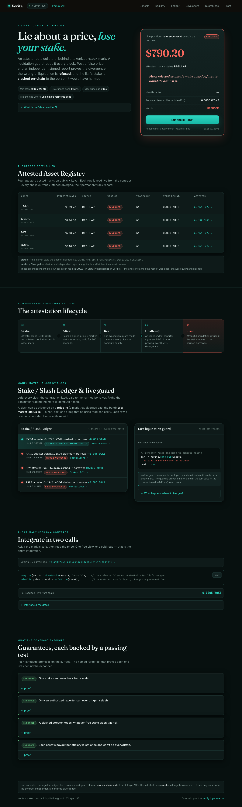

# Verita

**Staked accountability for tokenized-equity prices on X Layer.** An attester puts real money behind "this asset is safe to mark right now." When they lie, anyone can slash that money to the borrower the lie would have hurt.

> Lie about a price, lose your stake.


**Live console:** https://verita-phi-rouge.vercel.app
**Verita on X Layer 196:** [`0xF3d0E2768F43062b532b3d4bb63c155238FA9176`](https://www.oklink.com/x-layer/address/0xF3d0E2768F43062b532b3d4bb63c155238FA9176)



## What is Verita?

Tokenized equities (xStocks) track real stocks that **halt**, **split**, and **de-peg**. A generic price feed keeps reporting a number straight through a trading halt, so a lending protocol reading that feed liquidates a borrower on a mark the market itself has frozen. X Layer's own on-chain equity verifier is deployed but never configured: `verify(...)` reverts `VerifierNotFound` and its fee/access controllers are the zero address. There is nothing on-chain telling a protocol that a mark is unsafe to act on.

Verita fills that gap with a primitive, not a feed. An attester stakes collateral and asserts an asset's price **and its market status** (regular, halted, split-pending, de-pegged). Consumers call `safePrice(asset)`, which **reverts** on a stale, halted, or diverged mark instead of returning a lie. Anyone holding an independent signed report that contradicts the attestation calls `challenge(...)` and the attester's stake is slashed to the party the bad mark would have harmed.

The moat is the **market-status** attestation. A halt, a split, or a de-peg is the un-feedable slice no clean price feed provides, and it is exactly where naive protocols wrongfully liquidate.

## Live on-chain proof

Every claim below re-resolves against public X Layer 196 with none of our infrastructure involved.

| Event | What happened | Tx |
|-------|---------------|----|
| Deploy | `Verita(WOKB)` + set reporter + register beneficiary | [`0x75b899…107366`](https://www.oklink.com/x-layer/tx/0x75b89902976811758cdff54d65e10a5f051073669c9528200ea272d790a172a9) |
| **Slash (price divergence, HERO)** | attester marked wSPYx at a stale price, an independent report at the true price slashed 0.005 WOKB to the borrower; asset latched `diverged` | [`0x485a2f…8ae0c0`](https://www.oklink.com/x-layer/tx/0x485a2fd82d0e8ca9f0ed11edf7d8064d3a1bee77f3a090015bb958f9568ae0c0) |
| **Slash (status contradiction)** | attester marked wNVDAx `REGULAR` at the true price, a `HALTED` report at the same price slashed 0.005 WOKB with reason `status-contradiction` (zero price divergence) | [`0x9a1ba5…f6afc`](https://www.oklink.com/x-layer/tx/0x9a1ba59b9cf4b17fe7d8ec2a19b0352284ebcb53eb175c2383326c78fbcf6afc) |

The status-contradiction slash is the point of the whole system: money moved on a lie about **market state**, not price, which no price oracle can catch.

## Core invariants

Each is enforced on-chain and produces a named revert. The console's Guarantees strip maps each to a passing forge test.

- **No attestation without free staked collateral.** Staking behind a second asset while the first is still live reverts `StakeLocked`. A single stake cannot back two assets at once.
- **A bad mark is refused, not returned.** `safePrice()` reverts `MarketNotOpen` on a halted/split/closed status, `StaleAttestation` past `maxAge`, and `Diverged` once the asset is latched. Consumers cannot read a lie.
- **Only an authorized independent reporter can trigger a slash.** A challenge signed by an unknown key reverts `NotAReporter`; a challenge that does not actually contradict the attestation reverts `NoDivergence`.
- **A slashed attester keeps nothing behind that asset**, and the stake still locked elsewhere is untouched (`test_WithdrawAfterSlash`).
- **A slash beneficiary is set once.** `registerBeneficiary` reverts `BeneficiaryAlreadySet` on a second call, so a consumer's payout target cannot be overwritten later.

## How it works

```
  independent price/status report (EIP-712 signed)
                    |
                    v
  attester --stake--> Verita.attest(asset, price, status)
                    |
   consumer.safePrice(asset) --> reverts on halt/stale/divergence, else returns price + charges fee
                    |
   anyone.challenge(asset, report) --> price OR status contradicted?
                    |                          |
                  no: revert NoDivergence      yes: Slashed(attester -> beneficiary), asset latched diverged
```

## Deployed contract (X Layer, chainId 196)

| Contract | Address |
|----------|---------|
| Verita | [`0xF3d0E2768F43062b532b3d4bb63c155238FA9176`](https://www.oklink.com/x-layer/address/0xF3d0E2768F43062b532b3d4bb63c155238FA9176) |

Settlement token on the live proof is WOKB (USDG is dormant on X Layer with no retail liquidity, so the live value moves in WOKB; USDG remains the designed-for token in the test suite and fork consumer demo). See [LIMITATIONS.md](LIMITATIONS.md).

## On-chain events

| Event | When |
|-------|------|
| `Attested(asset, price, status, attester, expiry)` | an attester posts a price and market status |
| `SafePriceRead(asset, consumer, price, fee)` | a consumer reads a valid mark and pays the per-read fee |
| `Slashed(asset, attester, beneficiary, amount, reason)` | a challenge succeeds; `reason` is `price-divergence` or `status-contradiction` |
| `FeeCollected(consumer, amount)` | a per-read fee is banked to the fee pot |

## Integrate in two calls

```solidity
import {IVerita} from "./interfaces/IVerita.sol";

IVerita verita = IVerita(0xF3d0E2768F43062b532b3d4bb63c155238FA9176);

if (!verita.isTradeable(asset)) revert MarketClosed(); // status/freshness gate
uint256 price = verita.safePrice(asset);               // reverts on unsafe, else returns + charges fee
```

The reference consumer, [`LiquidationGuard.sol`](src/LiquidationGuard.sol), calls `safePrice()` on every borrow and liquidation. When Verita refuses the mark the liquidation reverts (`LiquidationGuard.sol:63`), so a wrongful liquidation on a frozen mark is impossible.

## Security architecture

| Layer | Mechanism | Enforcement point |
|-------|-----------|-------------------|
| Read safety | `safePrice` reverts on halt/stale/divergence | `src/Verita.sol:137` (`Diverged`), `src/Verita.sol:140` (`MarketNotOpen`) |
| Slash authority | only an authorized reporter can challenge | `src/Verita.sol:156` (`NotAReporter`) |
| Slash validity | a challenge must actually contradict the attestation | `src/Verita.sol:171` (`NoDivergence`) |
| Slash payout | attester stake moves to the registered beneficiary | `src/Verita.sol:189` (`Slashed`) |
| Consumer safety | liquidation reads through Verita, reverts on refusal | `src/LiquidationGuard.sol:63` |

Threat model and out-of-scope items are in [SECURITY.md](SECURITY.md).

## Honesty ledger

| Claim | Status | Evidence |
|-------|--------|----------|
| X Layer's equity verifier is deployed but never configured | VERIFIED | `cast call 0xcE73…536E7 "verify(bytes,bytes)"` reverts `0xb151802b`; controllers `0x0` |
| A wrongful liquidation on a bad mark is refused | VERIFIED (tests + fork) | `test_BorrowThenLiquidateRefusedOnHalt`; wTSLAx has no retail liquidity on 196, so the consumer beat is fork-only |
| The lying attester's stake is slashed to the borrower | VERIFIED on 196 | tx [`0x485a2f…8ae0c0`](https://www.oklink.com/x-layer/tx/0x485a2fd82d0e8ca9f0ed11edf7d8064d3a1bee77f3a090015bb958f9568ae0c0) |
| Verita slashes on a market-status contradiction, not only price | VERIFIED on 196 | tx [`0x9a1ba5…f6afc`](https://www.oklink.com/x-layer/tx/0x9a1ba59b9cf4b17fe7d8ec2a19b0352284ebcb53eb175c2383326c78fbcf6afc), reason `status-contradiction` |
| Each guarantee maps to a passing named test | VERIFIED | `forge test` 14/14 |

Full ledger: [CLAIMS.md](CLAIMS.md).

## Verify in 60 seconds

```bash
git clone https://github.com/dmustapha/verita.git
cd verita
forge test                 # 14/14, keyless
bash scripts/verify-claims.sh   # re-resolves the slash from public 196, no local keys
```

`verify-claims.sh` reads only the public X Layer RPC and recomputes the slashed amount from on-chain state. Nothing of ours is in the path.

## Running the console locally

```bash
git clone https://github.com/dmustapha/verita.git
cd verita/web
npm install
cp .env.example .env.local   # fill in the values (Verita address is already the live one)
npm run dev                  # http://localhost:3000
```

The console reads live X Layer 196 in the browser. The kill-shot button signs a fresh independent report at click time and fires a real challenge; its signing and gas keys are server-only (never shipped to the browser).

## Tests

- **Contracts:** `forge test` runs 14 tests covering attestation, staking locks, the two slash paths (price divergence and status contradiction), read refusal, and the consumer refuse-to-liquidate path.
- **Design system:** `cd web && npm test` runs 35 checks (token drift, forbidden defaults, contrast >= 4.5:1, brand and CSS parity).

## Tech stack

Solidity 0.8.24 and Foundry for the primitive and the reference consumer. A Node relayer signs EIP-712 reports from two independent price sources. A Next.js 15 console (App Router, ethers v6) reads the live chain and drives the kill-shot.

## Documentation

- [CLAIMS.md](CLAIMS.md) claim ledger with a recompute path for every headline
- [SECURITY.md](SECURITY.md) threat model and out-of-scope
- [LIMITATIONS.md](LIMITATIONS.md) scope boundaries and the WOKB/USDG settlement note
- [DECISIONS.md](DECISIONS.md) architecture decision records
- [SUBMISSION_STATUS.md](SUBMISSION_STATUS.md) what works, what is fork-only, and why

## License

MIT. See [LICENSE](LICENSE).
